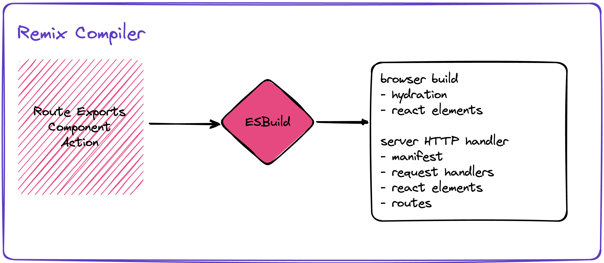
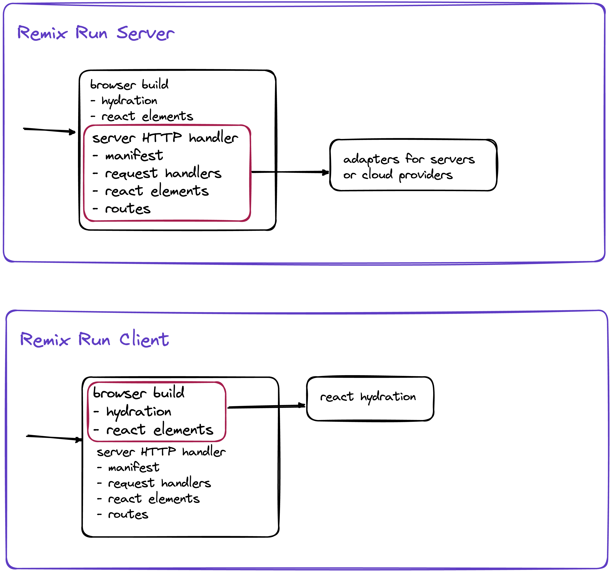
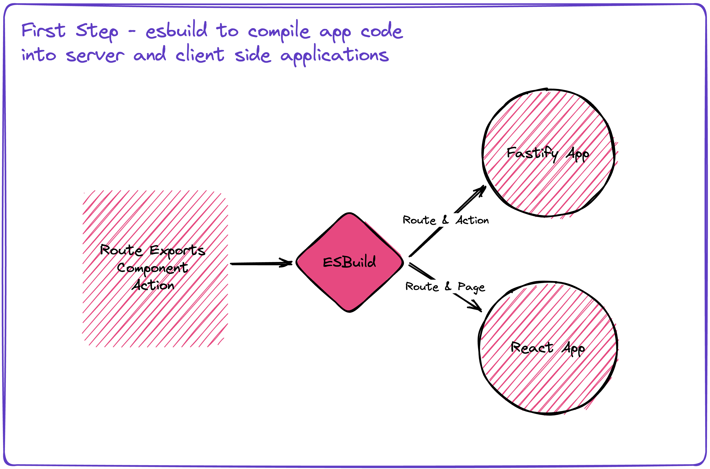
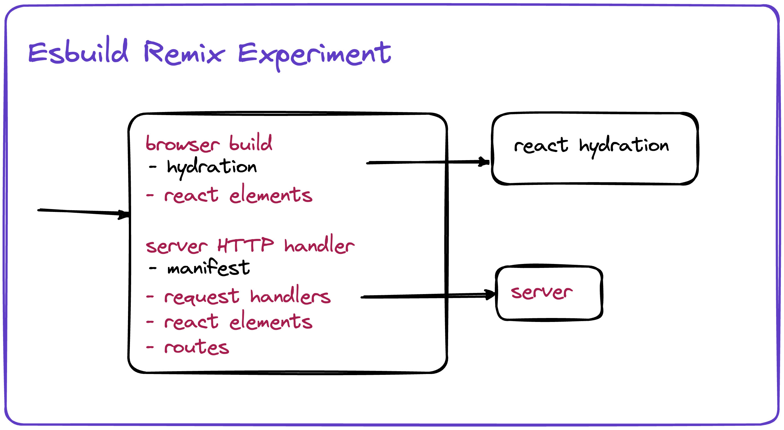

# Esbuild Remix Experiment

> DIY Let's do Remix today with own hands!

Alex Korzhikov - March, 2023

- How Remix Works
  - [Example App](https://codesandbox.io/p/sandbox/wandering-dream-xeomqw)
- Esbuild Experiment
- Summary
  - Problems

## [How Remix Works](https://remix.run/docs/en/main/pages/technical-explanation)

- compiler - server side and client side app, alongside with manifest meta information?

- server
  - serves routes come from build
  - adapters to transform routes to a particular http server
  - controller and view (not a model) - each route can contain loader, action, and default component
- client
  - hydration

## Esbuild Experiment

### Goals

- Play around esbuild and compile javascript code
- Understand how remix works

### Steps

- dev routes server
- add esbuild, jsx
- ~~dev routes client~~
- react ssr

### Summary

### Problems

- load data from endpoint loaders
- add Virtual Machine context for importing routes and components
- exclude hardcoded "dist" from compile and dev server
- streams instead of file render to sting
  - hydrate react on client side
  - server side components?
- move & optimize transform and export to esbuild plugin
  - use esbuild metafile analyze options to get information about outputs
  https://esbuild.github.io/api/#metafile
- add react router?

### Links

- [Esbuild Remix Experiment](https://github.com/x-technology/back-to-the-roots-with-remix/tree/main/esbuild-experiment)
- [Remix](https://remix.run/)
- [React Streaming In Depth: NextJS! Remix! DIY!- Jack Herrington](https://www.youtube.com/watch?v=o3JWb04DRIs)
- [Fundamentals of Redux Course from Dan Abramov](https://egghead.io/courses/fundamentals-of-redux-course-from-dan-abramov-bd5cc867)
- [Test Remix App](https://github.com/korzio/testcodesandbix)